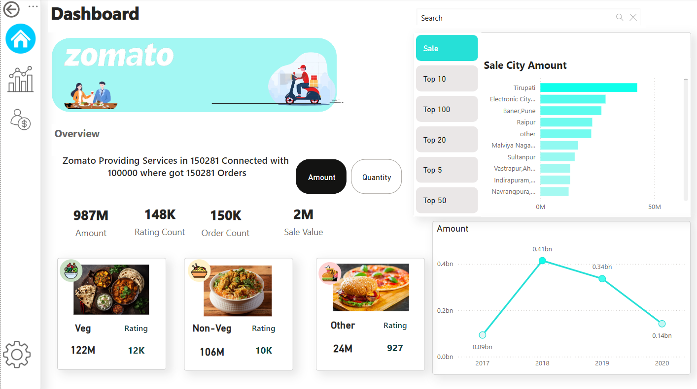

# Zomato Dashboard

This project leverages Power BI to create a comprehensive dashboard that provides a wide range of analytics for Zomato data. The dashboard visualizes key metrics and trends, offering valuable insights into sales, customer preferences, and restaurant performance.



## Features

### Sales Analytics💸

- **Total Sales**: Visualize the overall sales across different time periods.
- **Sales by Category**: Break down sales into categories like veg and non-veg.
- **Sales Trends**: Identify sales trends over time with interactive line charts.

### Order Insights 📦

- **Quantity Analysis**: Analyze the quantity of items sold across various categories.
- **Order Ratings**: Evaluate the ratings given by customers for different orders.
- **Order Distribution**: Visualize the distribution of orders across different regions and times.

### Customer Preferences 🍴

- **Veg vs Non-Veg Sales**: Compare the sales of vegetarian and non-vegetarian items.
- **Popular Items**: Identify the most popular items based on sales and quantity.
- **Customer Demographics**: Understand the demographics of customers placing orders.


## Technologies Used 🛠️

- **Power BI**: Utilized for creating interactive and dynamic visualizations.
- **DAX**: Used for creating calculated columns and measures to enhance the analytics.
- **Data Sources**: The data is sourced from Zomato’s extensive dataset, including order details, customer information, and restaurant data.

## How to Use

1. **Clone the Repository**:
   ```sh
   git clone https://github.com/Vishalpatil0111/zomato-dashboard.git

2.**Open Power BI**:

- Import the dataset provided in the repository.
- Load the Power BI template file (`zomato.pbix`)

3.**Explore the Dashboard**:

- Interact with various visualizations to gain insights.
- Use filters to customize the data view as per your requirements.
